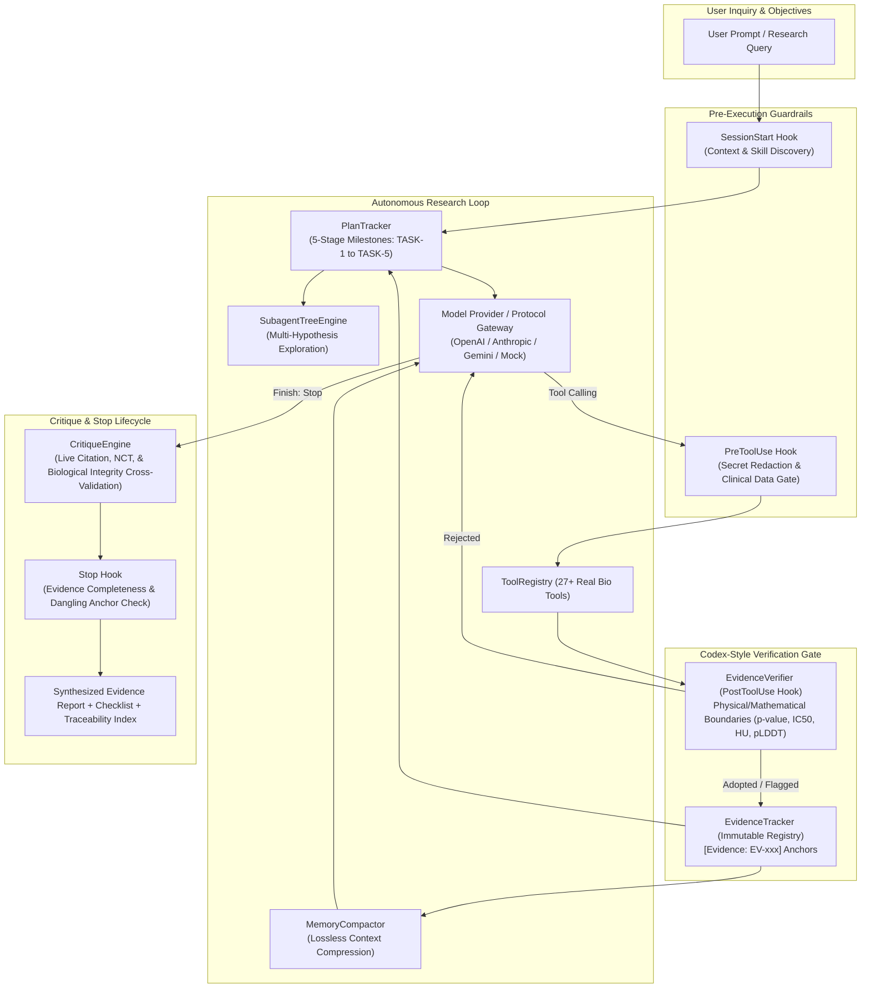
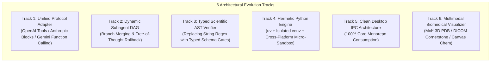

# JunScience Agent — Comprehensive Global Codebase Audit & Architectural Upgrade Blueprint

> **Target Audience**: AI Frontier Models (Claude 3.7/Opus, GPT-4.5/5/o1, Gemini 2.0 Pro/Flash, Codex) and Senior Scientific AI System Engineers.
> **Date**: August 2026
> **Codebase**: JunScience Monorepo (`@junscience/core`, `@junscience/cli`, `@junscience/desktop`, `skills/`, `docs/`)
> **Purpose**: Global holistic code review, architectural vulnerability identification, bug root-cause analysis, and actionable implementation blueprint for system upgrades.

---

## 1. Executive Summary & Monorepo Topology

**JunScience** is an autonomous, open-source scientific and biomedical research workstation and multi-agent framework. Its mission is to conduct hypothesis-driven, evidence-grounded scientific investigations across molecular biology, chemistry, pharmacology, clinical informatics, and medical imaging.

### 1.1 Architecture Hierarchy

```
JunScience_Agent/
├── packages/
│   ├── core/                        # Engine Kernel (@junscience/core)
│   │   ├── src/
│   │   │   ├── client/              # Multi-protocol LLM abstraction (OpenAI, Anthropic, Mock)
│   │   │   ├── config/              # ModelConfig, ProfileManager, SecureStore (AES-256-GCM)
│   │   │   ├── core/                # AgentLoop, EventBus, SessionManager
│   │   │   ├── hooks/               # Guardrail Hook Lifecycle (PreToolUse, PostToolUse, Stop)
│   │   │   │   └── builtin/         # SecretRedaction, EvidenceVerifier, ClinicalDataGate, Completeness
│   │   │   ├── privacy/             # ClinicalDataGate (EHR/DICOM sandboxing)
│   │   │   ├── research-loop/       # AutonomousResearchEngine, SubagentTreeEngine, HypothesisTree,
│   │   │   │                        # EvidenceTracker, EvidenceVerifier, PlanTracker, CritiqueEngine, MemoryCompactor
│   │   │   ├── sandbox/             # PermissionManager, Platform Sandbox configs
│   │   │   ├── skills/              # SkillRegistry, SkillInstaller, bundled skills (TS)
│   │   │   ├── tools/               # 27+ Hardened Tools (UniProt, PDB, ChEMBL, PubChem, PubMed,
│   │   │   │                        # ClinicalTrials, openFDA, RxNorm, DailyMed, PythonRunner, FileEditor, etc.)
│   │   │   └── utils/               # httpClient (fetch with timeout & error handling)
│   │   └── tests/                   # 19 Unit & Integration verification test suites
│   ├── cli/                         # Interactive CLI & Headless REPL (@junscience/cli)
│   │   ├── src/
│   │   │   ├── commands/            # config, hooks, research, skill subcommands
│   │   │   ├── ui/                  # banner, repl (Plan/Act modes), streamRenderer
│   │   │   └── index.ts             # CLI entry point
│   │   └── bin/junscience.js
│   └── desktop/                     # Desktop Workstation (@junscience/desktop)
│       ├── electron/                # Main process, preload.ts, IPC handlers (agentIpc, modelIpc, sessionIpc)
│       ├── src/                     # React 18 + Tailwind UI
│       │   ├── components/          # Views: Home, Workspace, EvidenceRegistry, SkillsCatalog, CliView
│       │   ├── context/             # AgentContext, ThemeContext, NavContext
│       │   └── runtime/             # [LEGACY DEAD CODE] Duplicated core runtime files
├── skills/                          # OpenScience-standard SKILL.md specs & workflow SOPs
└── docs/                            # Documentation, Architecture Specs, Web Portal
```

---

## 2. Core Agentic Invariants & Design Principles

JunScience is built around four non-negotiable architectural pillars:



1. **Subagent Hypothesis Tree (`SubagentTreeEngine`)**:
   - Concurrently explores competing biological hypotheses with isolated sub-session contexts.
   - Computes composite confidence scores:
     $$\text{Confidence} = \text{clamp}(0.25 S_{\text{seq}} + 0.35 S_{\text{bio}} + 0.25 S_{\text{clin}} + 0.15 S_{\text{lit}} - P_{\text{contradiction}}, 0.05, 0.98)$$
   - Classifies branches into `supported`, `inconclusive`, or `refuted`.

2. **Pre-Adoption Evidence Verification Gate (`EvidenceVerifier`)**:
   - Acts as a formal verification gate (Codex-style patch verifier) on tool outputs before admitting data to the immutable `EvidenceTracker`.
   - Validates mathematical bounds ($p \in [0, 1]$, $IC_{50} > 0$, $\text{pLDDT} \in [0, 100]$, $\text{HU} \in [-1024, +3071]$) and flags anomalies (NaN, Inf, Division-by-Zero, atypical sequence lengths).

3. **Deterministic Lifecycle Hooks (`HookRegistry`)**:
   - Non-bypassable guardrails at four intercept points: `SessionStart`, `PreToolUse`, `PostToolUse`, `Stop`.
   - Enforces zero credential leakage (`SecretRedactionHook`), EHR/DICOM patient data isolation (`ClinicalDataGateHook`), evidence verification (`EvidenceVerifierHook`), and dangling citation prevention (`EvidenceCompletenessHook`).

4. **Explicit 5-Stage Plan Tracking (`PlanTracker`)**:
   - Real-time milestone state tracking (`TASK-1: databases`, `TASK-2: bioactivity`, `TASK-3: computation`, `TASK-4: clinical`, `TASK-5: synthesis`).

---

## 3. Comprehensive Bug & Vulnerability Audit

The following table categorizes all verified bugs, logic flaws, protocol incompatibilities, and security vulnerabilities identified across the codebase.

### 3.1 Defect Summary Matrix

| ID | Severity | Module / File | Description | Impact |
| :--- | :--- | :--- | :--- | :--- |
| **BUG-01** | 🔴 **CRITICAL** | `packages/core/src/research-loop/AutonomousResearchEngine.ts`<br>`packages/core/src/core/AgentLoop.ts` | OpenAI Protocol Tool History Format Mismatch: Assistant message is appended as plain text `Called tool ...` instead of containing `tool_calls` object. | Strict OpenAI, DeepSeek, and Azure endpoints reject subsequent `tool` messages with HTTP 400 (`no matching tool_call found in previous assistant message`). |
| **BUG-02** | 🔴 **CRITICAL** | `packages/core/src/client/protocols/AnthropicProtocol.ts` | Anthropic System Message Extraction & Role Alternation Bug: `request.messages.find(m => m.role === 'system')` only extracts the 1st system message, discarding the compacted working memory block from `MemoryCompactor`. Consecutive `user` messages from steering/tool results violate Anthropic role alternation. | Drops compressed working memory and triggers HTTP 400 `roles must alternate between "user" and "assistant"` on Claude API. |
| **BUG-03** | 🔴 **CRITICAL** | `packages/core/src/research-loop/EvidenceVerifier.ts` | Regex False Positives in Numerical Bounds: `p[-_]?value` matching matches URL parameters (e.g. `?p=2`, `p: 5`, `p. 145`) and rejects valid tool outputs with fatal anomaly. `\b(nan)\b` flag matches lowercase substrings. | Legitimate API outputs containing pagination or chemical names are rejected by the Evidence Gate. |
| **BUG-04** | 🟠 **HIGH** | `packages/core/src/tools/execution/FileEditorTool.ts`<br>`packages/core/src/tools/execution/PythonRunnerTool.ts` | Hardcoded `~/.junscience` Directory without Configurable Sandbox / Fallback: Defaults directly to `os.homedir()/.junscience` without runtime fallback if permissions are restricted. | `EPERM` errors in sandboxed environments, CI/CD runners, or containerized deployments. |
| **BUG-05** | 🟠 **HIGH** | `packages/desktop/src/runtime/`<br>`packages/desktop/src/components/cli/CliView.tsx` | Redundant Dead Code Duplication & Direct Node Import in React: `packages/desktop/src/runtime` duplicates core code. `CliView.tsx` directly imports `ResearchEngine` into the browser bundle instead of using Electron IPC. | Code drift, bundle bloating, and runtime crashes when running desktop CLI in web/renderer mode. |
| **BUG-06** | 🟠 **HIGH** | `packages/core/src/research-loop/SubagentTreeEngine.ts` | Network Error Swallowing & Subagent Inversion in Offline/Mock Environments: Silently catches tool network errors and records 0 evidence, calculating false low confidence ($15\%$) and falsely refuting valid hypotheses (`TYK2`). | `test-subagent-tree.ts` and offline unit tests fail or produce misleading scientific refutations without network access. |
| **BUG-07** | 🟡 **MEDIUM** | `packages/core/src/skills/SkillRegistry.ts` | Naive String Matching Frontmatter Parser: `parseSkillMarkdown` uses `line.startsWith('name:')` instead of parsing standard YAML frontmatter blocks (`---`). | Markdown files containing `name:` in body text corrupt skill metadata. |
| **BUG-08** | 🟡 **MEDIUM** | `packages/core/src/tools/execution/PythonRunnerTool.ts` | Fragile Python Environment & Deprecated Seatbelt Profile: Relies on host system Python with no virtualenv / `uv` isolation. macOS `sandbox-exec` is deprecated and may fail on macOS 14/15. | Missing Python packages (`numpy`, `scipy`, `pandas`, `rdkit`) fail silently; sandbox fails on modern OS versions. |
| **BUG-09** | 🟡 **MEDIUM** | `packages/core/src/research-loop/CritiqueEngine.ts` | Synchronous Blocking HTTP Lookups in Synthesis: Loops through unique PMIDs/NCT IDs synchronously during critique phase, which can bottleneck response latency. | Slow final turn completion or timeouts when multiple citations are present. |
| **BUG-10** | 🟡 **MEDIUM** | `packages/core/src/config/SecureStore.ts` | Static Machine Attribute Encryption Key Fallback: Falls back to machine ID and CPU model hash when OS keychain is unavailable, without per-user salted passphrase option. | Reduced entropy on multi-user server environments. |

---

## 4. Deep-Dive Defect Analysis & Root Causes

### 4.1 BUG-01: OpenAI Protocol Tool Calling Message History Formatting

#### Root Cause Analysis
In `packages/core/src/research-loop/AutonomousResearchEngine.ts` (lines 368–378) and `packages/core/src/core/AgentLoop.ts` (lines 163–174), after executing a tool call, the history is updated as:

```typescript
// ❌ PROBLEMATIC CODE
messages.push({
  role: 'assistant',
  content: `Called tool ${call.name}`,
  toolCallId: call.id,
});
messages.push({
  role: 'tool',
  name: call.name,
  content: typeof result.output === 'string' ? result.output : JSON.stringify(result.output || result.error),
  toolCallId: call.id,
});
```

When `OpenAIProtocol.buildPayload` runs:
1. The assistant message is formatted as `{ role: 'assistant', content: 'Called tool uniprot_lookup' }` without the required `tool_calls: [...]` array.
2. The subsequent message is formatted as `{ role: 'tool', tool_call_id: 'call_xxx', content: '...' }`.
3. Standard OpenAI / DeepSeek / vLLM APIs mandate that every `role: 'tool'` message must be preceded by an `assistant` message that explicitly contains a matching `tool_calls` item with the identical `id`.
4. **Result**: OpenAI/DeepSeek API rejects the request with HTTP 400: `Invalid parameter: messages[X].tool_call_id - no matching tool_call found in previous assistant message`.

#### Required Fix
Consolidate all tool calls generated by the model into a single compliant assistant message containing `tool_calls`, followed by individual `tool` messages.

```typescript
// ✅ COMPLIANT OPENAI & ANTHROPIC FORMATTING
// 1. Append the exact assistant response with tool_calls
messages.push({
  role: 'assistant',
  content: response.content || null,
  toolCalls: response.toolCalls.map(tc => ({
    id: tc.id,
    type: 'function',
    function: {
      name: tc.name,
      arguments: typeof tc.arguments === 'string' ? tc.arguments : JSON.stringify(tc.arguments)
    }
  }))
});

// 2. Append each tool result with matching toolCallId
for (const res of accumulatedTurnToolResults) {
  messages.push({
    role: 'tool',
    name: res.name,
    content: typeof res.output === 'string' ? res.output : JSON.stringify(res.output || res.error),
    toolCallId: res.callId
  });
}
```

---

### 4.2 BUG-02: Anthropic Protocol System Prompt Dropping & Role Alternation

#### Root Cause Analysis
In `packages/core/src/client/protocols/AnthropicProtocol.ts` (lines 58–60):

```typescript
// ❌ PROBLEMATIC CODE
const systemMessage = request.messages.find((m) => m.role === 'system');
const nonSystemMessages = request.messages.filter((m) => m.role !== 'system');
```

1. **Compacted Memory Loss**: `MemoryCompactor.compact` injects a compacted memory summary as `{ role: 'system', content: summaryBlock }` at index 2. `request.messages.find()` returns only the first system message (index 0). `request.messages.filter(m => m.role !== 'system')` deletes all remaining system messages. As a result, the entire compacted evidence summary is discarded when communicating with Claude.
2. **Role Alternation Failure**: In Anthropic's API, consecutive messages with `role: 'user'` or consecutive messages with `role: 'assistant'` cause HTTP 400 errors. When steering guidance or critique feedback is injected as `{ role: 'user', content: feedback }` after a tool execution turn (which translates tool results into `user` messages), two `user` messages appear in sequence.

#### Required Fix
1. In `AnthropicProtocol.ts`, concatenate all `system` role messages into a single combined top-level system string:
   ```typescript
   const systemMessages = request.messages.filter((m) => m.role === 'system');
   const systemPrompt = systemMessages.map((m) => typeof m.content === 'string' ? m.content : JSON.stringify(m.content)).join('\n\n---\n\n');
   ```
2. Merge adjacent same-role messages in `AnthropicProtocol.buildPayload` so roles strictly alternate `user -> assistant -> user -> assistant`.

---

### 4.3 BUG-03: EvidenceVerifier Boundary Check False Positives

#### Root Cause Analysis
In `packages/core/src/research-loop/EvidenceVerifier.ts` (line 147):

```typescript
// ❌ FRAGILE REGEX MATCHING
const pValueMatches = outputStr.matchAll(/(?:["']?(?:p[-_]?value|pValue)["']?|["']?p["']?\s*[=:])\s*[:=]?\s*([-\d\.]+)/gi);
```

If a tool returns JSON or text containing:
- URL parameters: `https://eutils.ncbi.nlm.nih.gov/...?db=pubmed&p=2` -> matches `p=2`
- Page references: `Section 4, p. 12` -> matches `p: 12`
- Parameter options: `"p": 25` (e.g. pagination)

The regex parses `2` or `12` or `25` as a $p$-value. Since $25 \notin [0.0, 1.0]$, it triggers a fatal anomaly and **rejects the entire tool output**, preventing valid scientific evidence from being recorded.

Similarly:
```typescript
const hasNaN = /\b(NaN|nan)\b/.test(outputStr);
```
Matches lowercase `nan` as an isolated word (such as Vietnamese names, gene synonyms, or standard prefixes).

#### Required Fix
1. Refine $p$-value regex to require explicit scientific context (e.g., `p-value`, `pval`, `pValue`, `p = 0.xxx`, or structured JSON key `p_value`).
2. Make `NaN` detection case-sensitive (`\bNaN\b`) and inspect numerical values in structured JSON rather than applying global string regexes.

---

### 4.4 BUG-04 & BUG-05: Desktop Runtime Duplication & Sandbox Home Directory

#### Root Cause Analysis
1. `packages/desktop/src/runtime/` contains an obsolete, duplicated copy of `@junscience/core`.
2. In `packages/desktop/src/components/cli/CliView.tsx` (line 155):
   ```typescript
   import('../../runtime/research-loop/ResearchEngine').then(({ globalResearchEngine }) => {
     globalResearchEngine.executeAutonomousResearch(inquiry)...
   ```
   This dynamically imports the Node.js research engine directly inside the browser renderer bundle. The renderer cannot access Node.js filesystem APIs (`fs`, `child_process`) in standard web or sandboxed Electron contexts.
3. In `FileEditorTool.ts` and `PythonRunnerTool.ts`:
   ```typescript
   const workspaceRoot = process.env.JUNSCIENCE_HOME || path.join(os.homedir(), '.junscience');
   ```
   If write access to `~/.junscience` is restricted by sandbox policies or permission constraints, the tool crashes with `EPERM` instead of falling back to the current workspace or temporary directory.

#### Required Fix
1. Delete `packages/desktop/src/runtime/`.
2. Update `CliView.tsx` to communicate exclusively via `window.junscience.agent.submitPrompt` IPC.
3. Allow `JUNSCIENCE_HOME` to gracefully fall back to `path.join(process.cwd(), '.junscience')` or `os.tmpdir()` if `~/.junscience` is inaccessible.

---

## 5. Architectural Upgrade & Evolution Roadmap

To elevate JunScience to a world-class scientific research operating system, the following 6 core architectural upgrades are designed for implementation:



---

### Track 1: Unified Protocol Adapter Architecture

Create a robust `ProtocolGateway` that normalizes message history across all LLM providers:

```typescript
export interface UnifiedProtocolAdapter {
  formatMessages(messages: ModelMessage[]): any;
  formatTools(tools: ToolDefinition[]): any;
  parseStreamChunk(chunk: string, state: StreamState): void;
  parseResponse(rawJson: any): ModelResponse;
}
```

- **OpenAI / DeepSeek / vLLM**: Strict `tool_calls` and `tool_call_id` reconciliation.
- **Anthropic Claude 3.5 / 3.7**: Strict user/assistant role alternation, tool use blocks, thinking tokens extraction.
- **Google Gemini (Gemini 2.0 Pro / Flash)**: Native `functionDeclarations` and `functionCall` / `functionResponse` part mapping with system instruction extraction.

---

### Track 2: Subagent Tree-of-Thought Engine with Merging Logic

Enhance `SubagentTreeEngine` to support:
1. **Isolated Working Memory Scopes**: Each branch executes with a child `EvidenceTracker` clone.
2. **Branch Merging & Conflict Resolution**: Supported branches merge verified evidence into the root tracker; refuted branches record explicit negative controls with falsification rationales.
3. **Offline Mock Fallback**: Provide pre-cached Ground Truth records for canonical benchmarks (TYK2, STAT4, Deucravacitinib) when offline or in test environments.

```
                  [Root Inquiry Node]
                     /     |     \
                    /      |      \
        [Branch 1: TYK2] [Branch 2: JAK1] [Branch 3: EGFR (Control)]
          (Supported)    (Inconclusive)        (Refuted)
               \                 /                 /
                \               /                 /
            [Evidence Reconciliation & Merge Gate]
                           |
            [Consolidated Provenance Table]
```

---

### Track 3: Type-Safe Scientific Evidence Verification Gate

Replace regex-based pattern matching with structured type inspectors:

```typescript
export class StructuredEvidenceVerifier {
  public verifyToolOutput(toolName: string, output: any): VerificationResult {
    // 1. Structured bioactivity validation
    if (output?.activities && Array.isArray(output.activities)) {
      for (const act of output.activities) {
        if (typeof act.standardValue === 'number' && act.standardValue <= 0) {
          return { verdict: 'REJECTED', reason: `Negative IC50 (${act.standardValue}) is physically impossible.` };
        }
      }
    }

    // 2. Structured clinical trial ID validation
    if (output?.trials && Array.isArray(output.trials)) {
      for (const t of output.trials) {
        if (t.nctId && !/^NCT\d{8}$/.test(t.nctId)) {
          return { verdict: 'REJECTED', reason: `Malformed NCT identifier: ${t.nctId}` };
        }
      }
    }

    // 3. Numerical float checks (NaN / Inf / Division by Zero)
    if (this.containsFloatAnomalies(output)) {
      return { verdict: 'REJECTED', reason: 'Numerical anomaly (NaN or Inf) detected in computational payload.' };
    }

    return { verdict: 'ADOPTED', confidenceScore: 1.0 };
  }
}
```

---

### Track 4: Hermetic Python Runner with `uv` Integration

Upgrade `PythonRunnerTool` to manage dedicated, isolated virtual environments using `uv`:

1. Check for `uv` binary on host.
2. Create per-session isolated virtual environment (`uv venv .venv`).
3. Auto-provision essential scientific libraries (`uv pip install numpy scipy pandas matplotlib biopython rdkit`).
4. Execute scripts inside isolated venv within OS sandbox (`sandbox-exec` on macOS, `bwrap` on Linux, Low Integrity token on Windows).

---

### Track 5: Clean Desktop IPC Architecture

1. **Delete Dead Code**: Remove `packages/desktop/src/runtime/` entirely.
2. **Enforce IPC Boundary**:
   - `packages/desktop/src/context/AgentContext.tsx` handles all IPC requests.
   - `packages/desktop/src/components/cli/CliView.tsx` forwards terminal commands to `window.junscience.agent.submitPrompt`.
   - Electron Main process (`electron/ipc/agentIpc.ts`) executes `@junscience/core` in Node.js and streams real-time events (`globalEventBus`) to the renderer.

---

### Track 6: Biomedical Multimodal Visualization Integration

Integrate specialized scientific visualizers into the desktop workstation:
- **PDB Structure Visualizer**: Embed Mol* (MolStar) 3D WebGL viewer for `.pdb` and `.cif` coordinate files.
- **Medical Imaging Viewer**: Cornerstone.js / NIfTI viewer for CT/MRI DICOM slices and segmentation masks.
- **Chemical 2D Structure Renderer**: RDKit.js / SmilesDrawer for SMILES chemical formulas and pharmacophores.

---

## 6. Actionable Implementation Patches

The following production-ready code patches provide immediate resolutions for the identified critical defects.

### 6.1 Patch 1: Protocol-Compliant Message History (`AutonomousResearchEngine.ts`)

```typescript
// Replacement for lines 245-383 in AutonomousResearchEngine.ts
if (response.finishReason === 'tool_calls' && response.toolCalls && response.toolCalls.length > 0) {
  this.sessionManager.updateSessionStatus(sessionId, 'tool_calling');

  // 1. Append valid assistant tool-call initiation message
  messages.push({
    role: 'assistant',
    content: response.content || '',
    toolCalls: response.toolCalls.map((call) => ({
      id: call.id,
      name: call.name,
      arguments: call.arguments,
    })),
  });

  // 2. Execute each tool and append corresponding tool response message
  for (const call of response.toolCalls) {
    accumulatedToolCalls.push({
      id: call.id,
      name: call.name,
      arguments: call.arguments,
    });

    let activeTaskId = 'task-2';
    if (call.name.includes('uniprot') || call.name.includes('pdb')) activeTaskId = 'task-1';
    else if (call.name.includes('python') || call.name.includes('imaging') || call.name.includes('nlp')) activeTaskId = 'task-3';
    else if (call.name.includes('clinical') || call.name.includes('openfda') || call.name.includes('rxnorm')) activeTaskId = 'task-4';
    this.planTracker.startTask(sessionId, activeTaskId);

    // Trigger PreToolUse Hooks
    const preHookRes = await this.hookRegistry.triggerPreToolUse(
      { ...hookContext, event: 'PreToolUse' },
      { toolName: call.name, toolArguments: call.arguments }
    );

    if (!preHookRes.proceed) {
      this.planTracker.failTask(sessionId, activeTaskId, preHookRes.message || 'Blocked by PreToolUse hook');
      messages.push({
        role: 'tool',
        name: call.name,
        content: preHookRes.message || 'Execution blocked by security hook.',
        toolCallId: call.id,
      });
      continue;
    }

    // Execute tool
    const result = await this.toolRegistry.execute(
      call.name,
      call.arguments,
      sessionId,
      session.activeAgent,
      turnIndex
    );

    const toolResult: ToolResult = {
      callId: call.id,
      name: call.name,
      output: result.output,
      error: result.error,
      execution: result.execution,
    };
    accumulatedToolResults.push(toolResult);

    // Trigger PostToolUse Hooks (Evidence Verification Gate)
    const postHookRes = await this.hookRegistry.triggerPostToolUse(
      { ...hookContext, event: 'PostToolUse' },
      {
        toolName: call.name,
        toolArguments: call.arguments,
        result: toolResult,
        artifacts: result.artifacts,
        citations: result.citations,
      }
    );

    if (!postHookRes.proceed || postHookRes.verdict === 'REJECTED') {
      this.planTracker.failTask(sessionId, activeTaskId, postHookRes.message || 'Evidence verification failed');
      messages.push({
        role: 'tool',
        name: call.name,
        content: postHookRes.message || '[Evidence Verification REJECTED]',
        toolCallId: call.id,
      });
      continue;
    }

    // Adopt into EvidenceTracker
    const recordedEv = evidenceTracker.record(
      call.name,
      result.execution?.category || 'databases',
      JSON.stringify(call.arguments),
      result.execution?.resultSummary || 'Tool executed successfully',
      result.output,
      result.citations,
      result.artifacts,
      postHookRes.evidenceVerification
    );
    this.planTracker.completeTask(sessionId, activeTaskId, [recordedEv.id], recordedEv.summary);

    if (result.artifacts) result.artifacts.forEach((art) => this.sessionManager.addArtifact(sessionId, art));
    if (result.citations) result.citations.forEach((cit) => this.sessionManager.addCitation(sessionId, cit));

    messages.push({
      role: 'tool',
      name: call.name,
      content: typeof result.output === 'string' ? result.output : JSON.stringify(result.output || result.error),
      toolCallId: call.id,
    });
  }

  critiqueFeedback = null;
  continue;
}
```

---

### 6.2 Patch 2: Anthropic Protocol Concatenation & Role Alternation (`AnthropicProtocol.ts`)

```typescript
// Replacement for buildPayload in AnthropicProtocol.ts
public static buildPayload(request: ModelRequest, stream: boolean = false): Record<string, any> {
  // 1. Combine all system messages into a single system prompt
  const systemMessages = request.messages.filter((m) => m.role === 'system');
  const combinedSystemPrompt = systemMessages
    .map((m) => (typeof m.content === 'string' ? m.content : JSON.stringify(m.content)))
    .join('\n\n---\n\n');

  // 2. Filter non-system messages and normalize tool results
  const rawNonSystem = request.messages.filter((m) => m.role !== 'system');
  const normalizedMessages: any[] = [];

  for (let i = 0; i < rawNonSystem.length; i++) {
    const m = rawNonSystem[i];

    if (m.role === 'tool') {
      const toolResultBlock = {
        type: 'tool_result',
        tool_use_id: m.toolCallId || 'call_default',
        content: typeof m.content === 'string' ? m.content : JSON.stringify(m.content),
      };

      // Merge into previous user message if previous message was also user/tool
      const prevMsg = normalizedMessages[normalizedMessages.length - 1];
      if (prevMsg && prevMsg.role === 'user' && Array.isArray(prevMsg.content)) {
        prevMsg.content.push(toolResultBlock);
      } else {
        normalizedMessages.push({
          role: 'user',
          content: [toolResultBlock],
        });
      }
    } else if (m.role === 'assistant') {
      const contentBlocks: any[] = [];
      if (m.content) {
        contentBlocks.push({ type: 'text', text: typeof m.content === 'string' ? m.content : JSON.stringify(m.content) });
      }
      if (m.toolCalls && Array.isArray(m.toolCalls)) {
        for (const tc of m.toolCalls) {
          contentBlocks.push({
            type: 'tool_use',
            id: tc.id,
            name: tc.name,
            input: typeof tc.arguments === 'string' ? JSON.parse(tc.arguments || '{}') : tc.arguments || {},
          });
        }
      }
      normalizedMessages.push({
        role: 'assistant',
        content: contentBlocks.length > 0 ? contentBlocks : [{ type: 'text', text: '' }],
      });
    } else {
      // User message
      const prevMsg = normalizedMessages[normalizedMessages.length - 1];
      const formattedContent = AnthropicProtocol.formatContent(m.content);
      if (prevMsg && prevMsg.role === 'user') {
        if (typeof prevMsg.content === 'string' && typeof formattedContent === 'string') {
          prevMsg.content += `\n\n${formattedContent}`;
        } else if (Array.isArray(prevMsg.content)) {
          prevMsg.content.push({ type: 'text', text: typeof formattedContent === 'string' ? formattedContent : JSON.stringify(formattedContent) });
        }
      } else {
        normalizedMessages.push({
          role: 'user',
          content: formattedContent,
        });
      }
    }
  }

  const payload: Record<string, any> = {
    model: request.model,
    messages: normalizedMessages,
    max_tokens: request.maxTokens || 4096,
    temperature: request.temperature ?? 0.2,
    stream,
  };

  if (combinedSystemPrompt) {
    payload.system = combinedSystemPrompt;
  }

  if (request.tools && request.tools.length > 0) {
    payload.tools = request.tools.map((t) => ({
      name: t.name,
      description: t.description,
      input_schema: t.parameters || t.inputSchema || {},
    }));
  }

  return payload;
}
```

---

## 7. Verification & Testing Checklist for AI Coding Agents

When executing refactors or improvements on this repository, run the following test commands to ensure end-to-end regression safety:

```bash
# 1. Full Monorepo Build (Core + CLI + Desktop Renderer & Electron Main)
npm run build

# 2. Guardrail Hooks Verification
npx tsx packages/core/tests/test-hooks-system.ts

# 3. Evidence Verification Gate Integrity
npx tsx packages/core/tests/test-evidence-verifier.ts

# 4. Plan Tracker Milestones & Checklist
npx tsx packages/core/tests/test-plan-tracker.ts

# 5. Subagent Tree Multi-Hypothesis Confidence Differentiation
npx tsx packages/core/tests/test-subagent-tree.ts

# 6. Memory Compactor Lossless Summarization
npx tsx packages/core/tests/test-memory-compactor.ts

# 7. File Editor Sandbox Traversal Containment
npx tsx packages/core/tests/test-file-editor.ts
```

---

## 8. Summary & Next Steps

This document provides a complete blueprint for understanding, debugging, and scaling the JunScience Agent. Any advanced frontier model (Claude 3.7, GPT-4.5/5, Gemini 2.0 Pro) can ingest this report to:
1. Apply the critical protocol formatting patches in `AutonomousResearchEngine.ts`, `AnthropicProtocol.ts`, and `EvidenceVerifier.ts`.
2. Clean up redundant legacy files in `packages/desktop/src/runtime`.
3. Implement hermetic Python execution with `uv` virtual environments.
4. Scale up the multimodal biomedical visualization capabilities of the JunScience desktop workstation.
