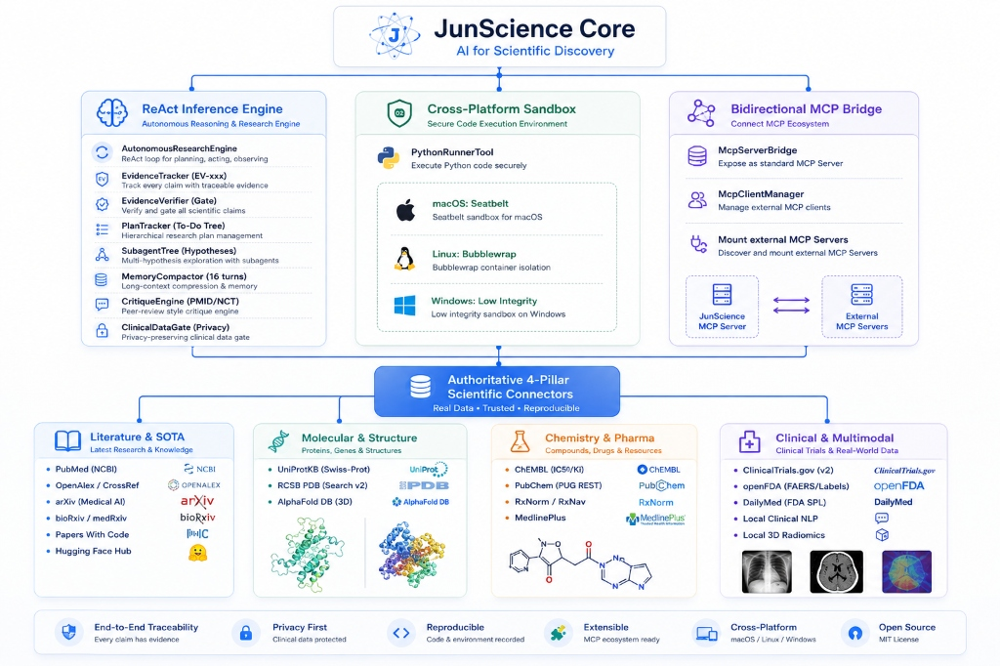

# JunScience 🧬 🔬

<div align="center">

**Open-Source Evidence-Traceable AI Agent Framework for Scientific & Biomedical Discovery**  
*(Molecular Biology • Clinical Evidence • Medical Multimodal • OS-Level Sandboxing)*

[](https://github.com/Benjamin-JHou/JunScience/actions/workflows/test.yml)
[](https://github.com/Benjamin-JHou/JunScience/actions/workflows/release.yml)
[](https://benjamin-jhou.github.io/JunScience/)
[](LICENSE)
[](https://modelcontextprotocol.io)
[]()

[English](#english) | [中文说明](#chinese) | [Documentation Portal](https://benjamin-jhou.github.io/JunScience/)

</div>

---

<a name="english"></a>
## 🌐 English Overview

### 📌 Positioning

**JunScience is an open-source, evidence-anchored scientific research agent powered by real empirical data and OS-level sandboxing.**

When provided with a complex research inquiry (e.g., *"Evaluate the allosteric selectivity of TYK2 JH2 pseudokinase vs ATP catalytic domain across JAK family kinases, screen real-world FAERS safety signals, and verify active Phase III clinical trial endpoints"*), JunScience autonomously:
1. Formulates an **explicit 5-stage research plan** and live To-Do checklist.
2. Deploys an isolated **Subagent Hypothesis Tree** to explore competing targets or mechanisms in parallel.
3. Retrieves real-time data across **PubMed, arXiv, bioRxiv, Papers With Code, Hugging Face, UniProtKB, RCSB PDB, ChEMBL, PubChem, ClinicalTrials.gov v2, openFDA, RxNorm, and DailyMed**.
4. Executes Python statistical scripts, radiomics, and clinical NLP within **air-gapped OS kernel sandboxes** (macOS Seatbelt, Linux Bubblewrap, Windows Low-Integrity Tokens).
5. Validates all outputs through the **Pre-Adoption Patch Verification Gate (`EvidenceVerifier`)** (checking $p \in [0, 1]$, $IC_{50} > 0$, CT $HU \in [-1024, 3071]$, and numerical anomalies).
6. Runs a **CritiqueEngine gate** to verify PMIDs, NCT numbers, and sequence lengths.
7. Produces a publication-grade scientific report with tamper-proof **`[Evidence: EV-xxx]`** tags and an immutable **Evidence Traceability Index**.

---

### ✨ Key Architecture & Features

| Architectural Pillar | Technical Implementation |
| :--- | :--- |
| **🔍 Pre-Adoption Patch Verification Gate** | Empirical validation before admission: Python computations, kinetic constants, and radiomics statistics are strictly verified by `EvidenceVerifier` for physical sanity boundaries ($p \in [0,1]$, $IC_{50}>0$, $HU \in [-1024,3071]$) and NaN/ZeroDivision anomalies before assigning `[Evidence: EV-xxx]`. Boundary failures trigger self-correcting feedback loops. |
| **🌲 Subagent Hypothesis Tree** | Concurrent multi-hypothesis exploration: The parent agent dynamically forks isolated subagent branches to evaluate competing targets/mechanisms in parallel, computing empirical multi-factor confidence gradients and synthesizing a structured **Hypothesis Comparison Matrix**. |
| **🛡️ Formal Lifecycle Hooks Gate (`HookRegistry`)** | Non-bypassable guardrails triggered across 4 lifecycle events (`PreToolUse`, `PostToolUse`, `SessionStart`, `Stop`): `secret-redaction` (blocks credential leaks), `evidence-verifier` (boundary checks), `clinical-data-gate` (guards EHR/DICOM data), and `evidence-completeness-check` (ensures 100% provenance). |
| **📝 Confined Workspace File Editor (`FileEditorTool`)** | In-workspace text/script modification with zero host escape: supports view, atomic str_replace, line insertion, and append strictly within session workspaces for iterative manuscript and data editing. |
| **📦 19 Domain Skills & Security Installer (`SkillInstaller`)** | Comprehensive scientific SOP library covering molecular biology, cheminformatics, statistics, MASLD RNA-seq, survival analysis, FAERS signal detection, and PRISMA systematic reviews, equipped with automated static security auditing (`junscience skill install <url>`). |
| **📋 Explicit Plan & Stream Orchestration** | Transparent scientific milestones: Formulates an explicit 5-stage research plan at Turn 1, streaming live task milestones (`[✔] Completed` / `[⏳] In Progress` / `[ ] Pending`) and attached `EV-xxx` evidence anchors via EventBus to CLI and Desktop UI. |
| **🔒 Kernel-Level OS Sandboxing** | Multi-platform script execution isolation:<br>• **macOS**: Seatbelt kernel sandbox (`sandbox-exec`) + physical network air-gap (`(deny default)`)<br>• **Linux**: Bubblewrap / Landlock unprivileged LSM container (`bwrap --ro-bind / / --proc /proc --dev /dev --unshare-net`)<br>• **Windows**: Mandatory Integrity Control (`Low Integrity Token` + Workspace ACL) |
| **⚖️ CritiqueEngine Anti-Hallucination Gate** | Live verification of cited **PMIDs (NCBI PubMed)** and **NCT IDs (ClinicalTrials.gov)**; validates canonical sequence lengths and flags suspect fragments. |
| **🔌 Bidirectional MCP Protocol** | Exposes all 20+ scientific tools as a standard Model Context Protocol (MCP) Server for external LLM environments (Claude Desktop / Cursor / IDEs), and dynamically mounts third-party MCP servers. |

---

### 🏗️ Architecture Overview

<div align="center">
  
</div>

---

### 🚀 Quick Start

#### 1. Download Native Desktop Application (v1.1.0)

Download pre-built installers directly from [GitHub Releases](https://github.com/Benjamin-JHou/JunScience/releases/tag/v1.1.0):
- **macOS Apple Silicon (M1/M2/M3/M4)**: [`JunScience-1.1.0-arm64.dmg`](https://github.com/Benjamin-JHou/JunScience/releases/download/v1.1.0/JunScience-1.1.0-arm64.dmg) (93.2 MB)
- **macOS Intel (x86_64)**: [`JunScience-1.1.0.dmg`](https://github.com/Benjamin-JHou/JunScience/releases/download/v1.1.0/JunScience-1.1.0.dmg) (98.0 MB)
- **Windows x64**: [`JunScience.Setup.1.1.0.exe`](https://github.com/Benjamin-JHou/JunScience/releases/download/v1.1.0/JunScience.Setup.1.1.0.exe) (NSIS Installer, 73.9 MB) / [`JunScience.1.1.0.exe`](https://github.com/Benjamin-JHou/JunScience/releases/download/v1.1.0/JunScience.1.1.0.exe) (Portable, 73.7 MB)

#### 2. CLI Execution via Monorepo

```bash
# Clone the repository
git clone https://github.com/Benjamin-JHou/JunScience.git
cd JunScience

# Install dependencies
npm install

# Build all packages
npm run build

# Run an autonomous scientific inquiry
npm run cli research "Evaluate the allosteric selectivity of TYK2 JH2 pseudokinase vs ATP catalytic domain across JAK family kinases"

# Inspect guardrails and scientific skills
npm run cli hooks list
npm run cli skill list
```

#### 3. Local Web Application (no `.exe` required)

The browser UI can run against the real local JunScience runtime. The HTTP server binds to
`127.0.0.1` only; model credentials, sessions, tools, and sandboxed execution remain in the
local Node.js process and are not exposed as browser-stored secrets.

```bash
# Production-style local build and server
npm run web

# Or use Vite hot reload while developing
npm run web:dev
```

Open [http://127.0.0.1:3000](http://127.0.0.1:3000). Set `JUNSCIENCE_WEB_PORT` to use a different port.

#### 4. TypeScript Core SDK Usage

```typescript
import { AutonomousResearchEngine, globalToolRegistry } from '@junscience/core';

const engine = new AutonomousResearchEngine({
  maxTurns: 16,
  modelProvider: activeModelProvider,
});

const turn = await engine.run(session, "Screen FAERS adverse event signals for Deucravacitinib");
console.log(turn.agentResponse);
```

---

### 🧪 Automated CI Test Matrix

JunScience runs full continuous integration tests across **macOS, Ubuntu Linux, and Windows** runners on GitHub Actions:

```bash
npm run build
npx tsx packages/core/tests/test-file-editor.ts           # Confined FileEditorTool & security isolation
npx tsx packages/core/tests/test-skill-installer.ts        # SkillInstaller static security audit rulebook
npx tsx packages/core/tests/test-hooks-system.ts           # 4 Formal lifecycle guardrail hooks
npx tsx packages/core/tests/test-expanded-skills.ts        # 19 Scientific domain skills with real public data
npx tsx packages/core/tests/test-subagent-tree.ts          # Subagent tree hypothesis confidence differentiation
npx tsx packages/core/tests/test-evidence-verifier.ts      # Pre-adoption numerical sanity & anomaly checks
npx tsx packages/core/tests/test-plan-tracker.ts           # Explicit plan mode & To-Do tracker
npx tsx packages/core/tests/test-medical-connectors.ts     # Clinical connectors & NCT verification
npx tsx packages/core/tests/test-clinical-research-loop.ts # Pure clinical ReAct research loop
```

---

<a name="chinese"></a>
## 🇨🇳 中文说明

### 📌 一句话定位

**JunScience 是一个专注于生物与医学领域的开源证据溯源型科研 Agent 框架**。

输入一个复杂的科学课题（例如 *“探讨 TYK2 变构抑制剂在红斑狼疮中的靶点选择性、真实世界 FAERS 不良反应信号与临床试验终点”*），JunScience 能够：
1. **显式制定 5 阶段调研计划** 与可交互 To-Do 看板。
2. 启动 **假设子 Agent 树 (SubagentTreeEngine)** 并发探索多候选靶点与机制假说并输出置信度梯度矩阵。
3. 跨 **PubMed、arXiv、bioRxiv、UniProtKB、RCSB PDB、ChEMBL、PubChem、ClinicalTrials.gov v2 (MAESTRO-NASH NCT03900429)、openFDA、DailyMed** 等权威数据库实时检索。
4. 调用 **受限工作区编辑器 (`FileEditorTool`)** 与 19 项专业科研 Skill，在 **操作系统内核安全沙盒** 内执行本地统计计算与手稿构建。
5. 经由 **4 大生命周期强制门禁 (`HookRegistry`)**（密钥脱敏、生成物前置严审 `EvidenceVerifier`、患者隐私闸门 `ClinicalDataGate`、引用完整性核验）确保数据真实合规。
6. 产出包含不可伪造证据锚点（`[Evidence: EV-xxx]`）与完整溯源清单的学术调研报告。

---

### ✨ 核心特性

- **🔍 生成物前置严审门禁 (`EvidenceVerifier`)**：拒绝盲目采纳计算结果，入库前强制校验物理极值（$p \in [0,1]$, $IC_{50}>0$, $HU \in [-1024,3071]$）与 NaN 异常，异常时触发自主纠错。
- **🌲 假设子 Agent 树 (`SubagentTreeEngine`)**：多假说并发分支探索，依据多维证据计算置信度并合成对比矩阵。
- **🛡️ 正式生命周期 Hooks 守护 (`HookRegistry`)**：在 `PreToolUse`、`PostToolUse`、`SessionStart`、`Stop` 四大节点强制拦截敏感凭证泄漏与未授权隐私外发。
- **📝 工作区受限文件编辑器 (`FileEditorTool`)**：提供文本精准替换、插入与追加能力，严格限定于会话目录内，杜绝任意 Shell 逃逸。
- **📦 19 项专业科研 Skill 库与安全安装机制 (`SkillInstaller`)**：涵盖分子生物、化学信息、生信分析、临床试验、系统综述与论文排版，支持安装前静态安全审查。
- **📋 显式科学规划与流式任务追踪器 (`PlanTracker`)**：推理之初显式制定 5 阶段调研计划，全双工广播每一步任务流转与挂载的证据勋章。
- **🔒 跨平台操作系统级内核沙盒**：macOS `sandbox-exec` 物理断网隔离、Linux `bwrap` LSM 容器化、Windows Low-Integrity MIC 访问控制，全量通过 GitHub Actions CI 验证。
- **🔌 双向 MCP 协议支持**：所有科研工具原生暴露为标准 Model Context Protocol (MCP) Server，亦可自由挂载第三方 MCP 工具。

### 🌐 本地 Web 模式（无需 `.exe`）

安装依赖后运行 `npm run web`，再访问 [http://127.0.0.1:3000](http://127.0.0.1:3000)。开发时可运行
`npm run web:dev` 启用 Vite 热更新。本地服务器仅监听回环地址；模型密钥、科研会话、工具调用和沙盒执行均保留在
Node.js 后端，不会作为浏览器本地存储中的明文密钥下发。

---

## 📄 License & Documentation

- Licensed under the [MIT License](LICENSE).
- Architectural specifications, guidelines, and notices are located in [`docs/`](docs/).
- Open Agent Conventions: [`AGENTS.md`](AGENTS.md).
