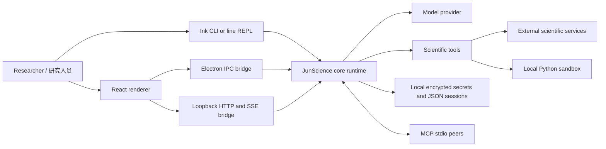
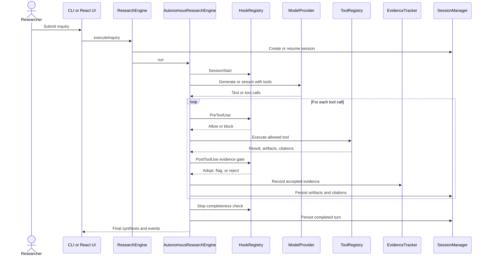

# JunScience Software Design Document (SDD)

> 中文标题：JunScience 软件设计说明书
>
> Document version: 1.0
>
> Product baseline: JunScience v1.4.0
>
> Source baseline: `1eeac83`
>
> Date: 2026-09-03
>
> Status: As-built design baseline

## 1. Document purpose / 文档目的

### 1.1 English

This Software Design Document describes the as-built architecture of JunScience, an autonomous
scientific and biomedical research workstation. It defines system boundaries, components,
interfaces, runtime behavior, data structures, security controls, deployment modes, quality
attributes, verification strategy, and known design risks. It is intended to be the engineering
baseline for implementation review, maintenance, security assessment, and future architectural
decisions.

This document describes the repository at the stated source baseline. It distinguishes implemented
controls from intended properties. A feature claim in product-facing material must not be treated as
an implemented guarantee unless the corresponding mechanism and verification evidence are identified
here or in a linked specification.

### 1.2 中文

本软件设计说明书描述 JunScience 自主科学与生物医学研究工作站的当前实现架构，明确系统边界、
组件职责、接口、运行流程、数据结构、安全控制、部署方式、质量属性、验证策略与已知设计风险。
本文档用于代码审查、维护、安全评估以及后续架构决策的工程基线。

本文档对应上述源码基线，并严格区分“已经由代码实现的控制”与“产品希望达到的属性”。除非某项
能力能在本文档或关联规范中对应到具体实现机制和验证证据，否则不应把产品描述直接视为已经得到
工程保证的事实。

## 2. Scope and system context / 范围与系统上下文

### 2.1 In scope / 范围内

- The `@junscience/core` autonomous research runtime.
- Model-provider abstraction and OpenAI-compatible or Anthropic-compatible protocol adapters.
- Scientific tool, skill, hook, evidence, planning, critique, and subagent subsystems.
- Local session and model-profile persistence.
- CLI, Electron desktop, and loopback local-Web delivery surfaces.
- MCP server and client bridges over standard input/output.
- Static GitHub Pages documentation portal and CI/CD packaging boundaries.

中文：本文档覆盖核心研究运行时、模型协议适配、科学工具与 Skill、生命周期 Hook、证据验证、
研究计划、批判性检查、子 Agent、会话与模型配置持久化、CLI、Electron、本地 Web、MCP、静态门户
以及 CI/CD 边界。

### 2.2 Out of scope / 范围外

- A hosted multi-tenant SaaS control plane.
- User account authentication, organization-level authorization, billing, or cloud tenancy.
- Regulatory certification such as FDA clearance, HIPAA attestation, or clinical validation.
- Production electronic health record integration and clinical decision support deployment.
- Guaranteed reproducibility of third-party databases or model-provider responses.

中文：当前系统不是多租户云平台，不提供组织级身份与权限、计费或云租户隔离；本文档也不构成
FDA、HIPAA 或临床有效性认证。第三方数据库与模型服务的可用性和确定性不属于 JunScience 可单独
保证的范围。

### 2.3 Primary actors / 主要参与者

| Actor | Responsibility | 中文说明 |
|---|---|---|
| Researcher | Submits inquiries, configures a model, reviews evidence and artifacts | 提交研究问题、配置模型并审阅证据与产物 |
| Local operator | Installs dependencies, starts a delivery surface, grants permissions | 安装依赖、启动应用并处理权限决策 |
| Model provider | Produces text, streaming deltas, and structured tool calls | 返回文本、流式增量和结构化工具调用 |
| Scientific data service | Supplies literature, molecular, biomedical, and clinical metadata | 提供文献、分子、生物医学和临床元数据 |
| MCP peer | Exposes tools to JunScience or consumes JunScience tools | 向 JunScience 提供工具或调用其工具 |
| CI/CD system | Builds, tests, packages, and publishes supported artifacts | 构建、测试、打包和发布产物 |

## 3. Architectural drivers / 架构驱动因素

| ID | Driver | Design response |
|---|---|---|
| AD-01 | Evidence-grounded scientific output | Tool results pass a post-use evidence gate before adoption into `EvidenceTracker` |
| AD-02 | Clinical privacy | `ClinicalDataGateHook` blocks unapproved raw clinical-text or medical-image transmission |
| AD-03 | Local-first operation | Sessions, profiles, secrets, artifacts, and Python workspaces are stored locally |
| AD-04 | Multiple user interfaces | CLI, Electron, and Web share `@junscience/core` and a common renderer bridge contract |
| AD-05 | Model portability | `ModelProvider` abstracts generation, streaming, tool calling, and connection testing |
| AD-06 | Extensible research operations | Registries provide dynamic tools, skills, hooks, agents, and MCP integrations |
| AD-07 | Observable execution | `EventBus` emits session, agent, tool, artifact, citation, plan, job, and permission events |
| AD-08 | Cross-platform distribution | npm workspaces, Electron Builder, Vite, and Node.js target macOS and Windows releases |

中文概述：JunScience 的核心设计目标是证据可追溯、临床数据本地优先、多终端复用、模型可替换、
工具与 Skill 可扩展、运行过程可观察，以及跨平台交付。所有目标都必须以代码中真实存在的机制为准。

## 4. High-level architecture / 总体架构



### 4.1 Layering / 分层

1. **Presentation layer** — React renderer, Ink CLI, and basic line-oriented CLI.
2. **Delivery adapters** — Electron preload/IPC and loopback HTTP/SSE Web bridge.
3. **Application orchestration** — `ResearchEngine` and `AutonomousResearchEngine`.
4. **Domain services** — planning, evidence, critique, hypothesis tree, memory compaction, hooks,
   skills, agents, tools, and clinical privacy.
5. **Infrastructure** — model protocol clients, filesystem persistence, subprocess execution,
   scientific HTTP connectors, MCP stdio, Vite, and Electron.

中文：系统采用表现层、交付适配层、应用编排层、领域服务层和基础设施层的逻辑分层。当前代码
仍使用若干进程内全局单例，因此这些层是明确的职责边界，而不是完全独立部署的服务。

## 5. Repository and module decomposition / 仓库与模块分解

| Module | Primary responsibility | Key dependencies |
|---|---|---|
| `packages/core` | Runtime, policies, scientific integrations, persistence, MCP | Node.js standard library |
| `packages/cli` | One-shot commands and interactive Ink/line REPL | Core, React, Ink |
| `packages/desktop/src` | Shared React renderer and application state | React, Vite, Core types |
| `packages/desktop/electron` | Native process, preload contract, IPC handlers | Electron, Core |
| `packages/desktop/web` | Loopback Web server, REST API, SSE event transport | Node HTTP, Vite, Core |
| `skills` | Human-readable scientific SOP packages | Markdown and optional scripts/examples |
| `src` and `public` | Public project portal | React/Vite and static assets |
| `docs` | Published portal artifacts and engineering specifications | GitHub Pages |

中文：`packages/core` 是唯一的研究运行时核心；CLI、Electron 和本地 Web 是不同交付适配器。
根目录的 `src`/`public` 是项目门户，不应与 `packages/desktop/src` 的工作站 UI 混淆。

## 6. Core component design / 核心组件设计

### 6.1 ResearchEngine

`ResearchEngine` is the facade used by delivery adapters. It resolves the active model profile,
creates or resumes a `RuntimeSession`, refreshes the model provider, and delegates one inquiry to
`AutonomousResearchEngine`.

中文：`ResearchEngine` 是 UI/CLI 面向核心的门面，负责解析当前模型配置、创建或恢复会话、刷新
模型提供者，并把单次研究问题交给自主研究引擎。

### 6.2 AutonomousResearchEngine

The engine executes a bounded ReAct-style loop. Its main responsibilities are:

1. Trigger `SessionStart` hooks.
2. Create or resume a five-stage `PlanTracker` plan.
3. Match and inject relevant Skill instructions.
4. Request a model response with registered tool schemas.
5. Apply queued mid-run steering and memory compaction.
6. Run `PreToolUse` hooks before every tool invocation.
7. Execute tools through `ToolRegistry` and `PermissionManager`.
8. Run `PostToolUse` verification before recording evidence.
9. Register artifacts and citations in the session.
10. Critique the draft and, when needed, re-inject feedback for another turn.
11. Run `Stop` hooks before final completion.

The current `ResearchEngine` configures a maximum of eight autonomous turns. Individual tools may
have their own timeouts.

中文：自主研究引擎执行有界的 ReAct 循环，把计划、Skill 注入、用户中途引导、上下文压缩、工具
调用、权限、证据门禁、批判性检查与停止检查串联起来。当前门面默认最多执行 8 个自主轮次。

### 6.3 Registries

| Registry | Unit registered | Runtime behavior |
|---|---|---|
| `AgentRegistry` | Specialized agent definitions | Resolves research roles |
| `ToolRegistry` | `ToolDefinition` | Permission check, progress events, execution, normalized errors |
| `SkillRegistry` | `SkillDefinition` | Inquiry matching and prompt injection |
| `HookRegistry` | `HookDefinition` | Priority-ordered lifecycle enforcement |

Registries are process-local. Registration is not persisted across restarts unless recreated by
startup code. External MCP tools are also registered into the process-local `ToolRegistry`.

中文：各 Registry 提供进程内扩展点。动态注册内容默认不会跨进程重启持久化；外部 MCP 工具也
以运行期工具定义的形式加入当前进程。

### 6.4 Evidence subsystem

`EvidenceVerifier` validates numerical and domain constraints, while `EvidenceTracker` records
accepted evidence with stable `EV-xxx` identifiers for the current run. `EvidenceVerifierHook`
places this check in the non-optional post-tool path. `EvidenceCompletenessHook` checks that final
evidence references resolve before stopping.

Evidence acceptance proves that configured structural and boundary checks passed; it does not by
itself prove clinical validity, causal correctness, absence of dataset bias, or independent
replication.

中文：证据验证器检查数值和领域约束，通过后由证据追踪器分配 `EV-xxx` 标识；停止 Hook 再检查
最终回答中的证据引用完整性。该门禁只能证明预定义检查已通过，不能替代临床验证、因果推断、偏倚
评估或独立重复实验。

### 6.5 Plan, critique, memory, and hypothesis tree

- `PlanTracker` represents a five-stage research plan and emits task transitions.
- `CritiqueEngine` evaluates synthesis quality and can request another evidence-gathering turn.
- `MemoryCompactor` reduces long model histories while retaining structured research context.
- `SubagentTreeEngine` explores competing hypotheses with bounded parallelism and isolated evidence
  scopes before synthesis.

中文：计划追踪器管理五阶段任务；批判引擎决定是否需要补充证据；记忆压缩器控制上下文规模；
假设树以隔离证据范围探索竞争假设，并在合成前进行比较。

## 7. Scientific tools and external interfaces / 科学工具与外部接口

### 7.1 Built-in tool inventory

| Category | Tools |
|---|---|
| Literature and ML assets | Literature Search, arXiv, bioRxiv, Papers with Code, Hugging Face Hub |
| Molecular databases | UniProt, ChEMBL, PubChem, PDB |
| Clinical and medical | ClinicalTrials.gov, openFDA, RxNorm, DailyMed, MedlinePlus, Clinical NLP, Medical Imaging |
| Local execution | Python Runner, Data Analysis, File Editor |
| Artifacts | Figure Generator |

All tools implement a `ToolDefinition` containing a name, description, category, required permission,
input schema, and asynchronous executor. `ToolRegistry.execute` normalizes progress, duration, result,
and failure events.

中文：内置工具覆盖文献与机器学习资产、分子数据库、临床/医学数据、本地执行和科研产物。
所有工具通过统一定义注册，并由工具注册表统一处理权限、进度、耗时、结果和异常。

### 7.2 Model-provider interface

`ModelProvider` defines `listModels`, `generate`, `stream`, and optional `testConnection`. Model
profiles select a protocol, base URL, model identifier, context limits, sampling options, streaming,
tool calling, headers, and secret key. Implemented protocol families are OpenAI-compatible and
Anthropic-compatible; `custom` is present in the type model but requires a concrete adapter before it
can be considered fully supported.

中文：模型提供者接口统一模型列表、普通生成、流式生成和连接测试。配置模型支持协议、端点、模型
名称、上下文和生成参数。当前具有明确协议适配实现的是 OpenAI-compatible 与
Anthropic-compatible；`custom` 类型属于预留扩展点。

### 7.3 MCP

- Server bridge: JSON-RPC 2.0 over stdio, supporting `initialize`, `tools/list`, and `tools/call`.
- Reported MCP protocol version: `2024-11-05`.
- Client manager: external stdio servers only; discovered tools are namespaced and registered locally.
- Discovery timeout: 8 seconds; tool-call timeout: 15 seconds.

中文：MCP 服务端通过 stdio 暴露工具列表和调用；客户端当前也只支持 stdio。发现的外部工具会
增加命名空间后注册到本地工具注册表。当前尚无 HTTP/SSE MCP transport。

## 8. Delivery surfaces / 交付界面

### 8.1 CLI

The CLI supports one-shot research, configuration, hooks, skills, and interactive operation. When
both standard input and output are TTYs, the default interactive experience uses Ink; otherwise it
falls back to the line-oriented REPL.

中文：CLI 支持一次性研究、模型配置、Hook、Skill 和交互运行；TTY 环境使用 Ink UI，非 TTY
环境回退到行式 REPL。

### 8.2 Electron desktop

The Electron main process starts a loopback static server on an ephemeral port and loads the React
renderer into a sandboxed `BrowserWindow`. The renderer has `nodeIntegration: false`,
`contextIsolation: true`, and Electron sandboxing enabled. A preload script exposes a narrow
`window.junscience` API. IPC handlers delegate model, session, and agent operations to Core.

中文：Electron 主进程在随机回环端口提供静态 UI，并使用关闭 Node 注入、开启上下文隔离和
Electron sandbox 的窗口加载页面。预加载脚本仅暴露收窄后的 `window.junscience` 接口。

### 8.3 Local Web

The local Web mode reuses the same React renderer and `window.junscience` contract. Its Node server:

- binds only to `127.0.0.1` on port 3000 by default;
- validates `Host` and, when present, `Origin` against the configured loopback endpoint;
- limits JSON bodies to 1 MiB;
- exposes REST operations for model profiles, sessions, and inquiries;
- streams runtime events and model deltas through Server-Sent Events;
- removes stored API keys from responses and preserves secrets server-side;
- serves Vite middleware in development and built assets in production.

The port can be changed using `JUNSCIENCE_WEB_PORT`. This mode is a single-user local application,
not a network service. Binding it to a non-loopback interface would require authentication,
authorization, TLS, CSRF protection, rate limiting, and a revised clinical threat model.

中文：本地 Web 复用与 Electron 相同的前端契约，由 Node 回环服务器提供 REST 与 SSE。默认仅监听
`127.0.0.1:3000`，校验 Host/Origin、限制请求体、不向浏览器返回已保存的 API key，并在后端执行
核心研究逻辑。该模式只适用于单用户本机环境；若扩展为局域网或公网服务，必须重新设计身份认证、
授权、TLS、CSRF、防滥用和临床隐私边界。

### 8.4 Local Web API

| Method | Path | Purpose |
|---|---|---|
| GET | `/api/health` | Liveness and mode identification |
| GET | `/api/events` | SSE stream for runtime events and deltas |
| GET/POST | `/api/model/profiles` | List or save profiles |
| DELETE | `/api/model/profiles/:id` | Delete a profile and its secret |
| GET/POST | `/api/model/active` | Read or select the active profile |
| POST | `/api/model/test` | Test a provider connection |
| GET/POST | `/api/sessions` | List or create sessions |
| GET/DELETE | `/api/sessions/:id` | Read or delete a session |
| POST | `/api/sessions/:id/rename` | Rename a session |
| GET | `/api/sessions/:id/export` | Export a Markdown report |
| POST | `/api/agent/inquiries` | Execute an inquiry through the real local runtime |

## 9. Runtime behavior / 运行时行为

### 9.1 Inquiry sequence



### 9.2 Event model

The process-local `EventBus` supports typed subscriptions, wildcard subscriptions, and a bounded
history of 1,000 events by default. Event families include session lifecycle, agent state, message
deltas, tool lifecycle, artifacts, citations, jobs, permissions, and plan transitions. Events are
used for observability and UI updates; they are not a durable audit log.

中文：事件总线默认保存最近 1,000 条进程内事件，并驱动 UI 更新。该历史不跨重启持久化，因此
不能替代合规审计日志。

### 9.3 Failure behavior

- Unknown tools raise a registry error.
- Permission denial produces a normalized failed `ToolExecutionResult` and `tool.error` event.
- Tool exceptions are converted to failed results rather than terminating the whole process.
- Corrupt session or profile files are ignored or replaced with empty in-memory state.
- Web API exceptions return JSON errors; model/tool failures remain represented in runtime results.
- Python execution is terminated after 30 seconds and stdout/stderr are each truncated at 50 KB.

中文：系统尽量把工具异常归一化为可观察的失败结果。Python 执行具有 30 秒超时及输出长度限制。
损坏的本地配置可能触发空状态回退，这提高可用性，但也要求未来增加显式告警和恢复流程。

## 10. Data design and persistence / 数据设计与持久化

### 10.1 RuntimeSession aggregate

`RuntimeSession` is the primary aggregate and contains identity, project, timestamps, active agent,
model association, status, ordered turns, artifacts, citations, and extensible metadata. Each `Turn`
stores user input, tool calls, tool results, final response, status, and timing.

中文：`RuntimeSession` 是主要聚合根，保存研究会话身份、模型、Agent、轮次、工具调用、工具结果、
产物、引用和元数据。

### 10.2 Filesystem layout

Unless `JUNSCIENCE_HOME` is set, persistent state is rooted at `~/.junscience`:

```text
~/.junscience/
├── config.json                 # Profiles without API keys; mode 0600
├── credentials.enc            # AES-256-GCM encrypted secret map; mode 0600
├── sessions/
│   └── <session-id>.json       # RuntimeSession snapshots
└── workspace/
    └── <session-id>/run-*/     # Python scripts and generated artifacts
```

Directories are created with mode `0700` where supported. Session and configuration storage is
single-process filesystem persistence and does not implement transactions, schema migrations,
cross-process locking, or database-level concurrency control.

中文：默认数据根目录为 `~/.junscience`。配置与凭据文件使用限制性权限，研究会话和 Python 工作区
按会话保存。当前是单进程 JSON/文件系统持久化，不具备数据库事务、迁移、跨进程锁或并发控制。

### 10.3 Secret storage

API keys are excluded from `config.json` and encrypted in `credentials.enc` using AES-256-GCM with a
random 12-byte IV and authentication tag. The encryption key is deterministically derived from host
and OS-user properties. This protects against casual plaintext disclosure but is not equivalent to
an OS keychain, hardware-backed key, or user-secret-derived key. An attacker with access to the
credential file and the same local identity/machine properties may be able to derive the key.

中文：API key 不写入普通配置文件，而是以 AES-256-GCM 加密保存。当前密钥由机器和本地用户属性
确定性派生，能够降低明文泄露风险，但不等同于系统钥匙串、硬件密钥或用户口令派生密钥。后续应
优先接入 macOS Keychain、Windows Credential Manager 或等价安全存储。

## 11. Security, privacy, and safety design / 安全、隐私与安全性设计

### 11.1 Trust boundaries

| Boundary | Untrusted input | Required control |
|---|---|---|
| Researcher to runtime | Prompts, paths, code, clinical text | Validation, hooks, permissions, sandbox |
| Model to tools | Tool name and arguments | Registry allowlist, schemas, pre-use hooks |
| External services to runtime | JSON, text, identifiers, citations | Parsing, timeouts, evidence verification |
| Browser to local server | HTTP method, path, headers, JSON | Loopback binding, Host/Origin validation, size limit |
| Runtime to model endpoint | Prompt and selected data | Secret redaction and clinical transmission gate |
| Runtime to subprocess | Python/script arguments and files | Dedicated workspace, environment restriction, OS sandbox |
| MCP peer to runtime | JSON-RPC and tool payloads | Namespacing, permission checks, timeouts |

### 11.2 Lifecycle hooks

| Hook | Event | Intended invariant |
|---|---|---|
| Secret Redaction | `PreToolUse` | Detect or redact credential-like material before tool use |
| Clinical Data Gate | `PreToolUse` | Prevent unapproved raw clinical-data transmission |
| Evidence Verifier | `PostToolUse` | Reject outputs that violate configured evidence constraints |
| Evidence Completeness | `Stop` | Detect unresolved evidence anchors in final synthesis |

Hooks execute by ascending priority. Pre-use rejection short-circuits tool execution; post-use
rejection prevents evidence adoption. Stop checks currently report issues but do not prevent return
of the final response, so consumers must surface `FLAGGED` outcomes rather than silently treating
them as success.

中文：Hook 按优先级执行。前置拒绝会阻止工具调用，后置拒绝会阻止证据入库。当前 Stop Hook 的
问题会形成 `FLAGGED` 结果但不会阻断最终文本返回，因此各 UI 必须清晰展示警告状态。

### 11.3 Python sandbox behavior

| Platform | Preferred mechanism | Current fallback |
|---|---|---|
| macOS | Seatbelt profile with restricted writes, secret-directory read denial, and no outbound network | Workspace subprocess unless strict mode is enabled |
| Linux | Bubblewrap namespace, read-only root, bound workspace, and unshared network | POSIX workspace subprocess |
| Windows | Low-integrity ACL on the session workspace | Workspace subprocess |

`JUNSCIENCE_SANDBOX=strict` or `JUNSCIENCE_REQUIRE_SANDBOX=true` blocks execution on macOS when
Seatbelt is unavailable. Equivalent fail-closed behavior is not currently implemented for Linux or
Windows fallbacks. Therefore, “air-gapped” is guaranteed only when the selected kernel mechanism is
successfully active; workspace-only fallback must not be represented as kernel or network isolation.

中文：macOS、Linux、Windows 均优先使用平台隔离机制，但当前都存在工作区子进程降级路径。只有
确认 Seatbelt/Bubblewrap 等内核机制实际启用时，才能声称网络隔离。macOS 可通过 strict 环境变量
失败关闭；Linux 和 Windows 尚需补充等价策略。

### 11.4 Clinical data policy

Raw clinical text and medical images require an explicit `ClinicalDataGate` confirmation handler
before external transmission. Aggregated radiomics features may be auto-approved when configured as
non-sensitive summaries. The audit log is currently in memory and is lost on restart.

This is a technical safeguard, not a complete clinical governance program. Deployments handling
protected health information require institutional policy, access control, de-identification
validation, retention rules, audit persistence, incident response, and applicable legal review.

中文：原始临床文本与医学影像默认禁止外发，去标识化的汇总影像组学特征可按策略放行。当前审批
日志仅存在内存中。该机制不是完整的临床治理或合规体系；涉及受保护健康信息时仍需机构政策、访问
控制、去标识验证、保留策略、持久审计、事件响应和法律审查。

## 12. Quality attributes / 质量属性

### 12.1 Security

- Least-privilege renderer bridges for Electron and Web.
- No plaintext API key in the profile configuration file or Web responses.
- Tool allowlisting and lifecycle interception.
- Kernel sandbox preferred for untrusted scientific scripts.
- Fail-closed handling required for raw clinical-data transmission.

### 12.2 Reliability

- Bounded autonomous turns and subprocess timeouts.
- Tool errors normalized into runtime results.
- Session snapshots persisted after meaningful changes.
- Independent CI jobs use `fail-fast: false` across supported runners.

### 12.3 Maintainability

- TypeScript contracts define model, runtime, event, tool, skill, and bridge boundaries.
- UI transports share the `JunScienceDesktopAPI` shape.
- Registries avoid hard-coding orchestration against individual tools and skills.
- Source and compiled artifacts must remain separated; `dist` is a build output.

### 12.4 Performance

- Model tokens are streamed where the provider supports streaming.
- SSE broadcasts Web runtime events without polling.
- In-memory registries and event dispatch minimize coordination overhead.
- Concurrency must remain bounded for hypothesis exploration and external tools.

### 12.5 Scientific quality

- Evidence is adopted only after explicit post-tool verification.
- Final claims should resolve to recorded evidence anchors.
- Citations and artifacts are stored with the session.
- Mock-mode output must be visibly identified and must not be presented as live experimental evidence.

中文：质量设计围绕最小权限、受控失败、可维护的类型契约、流式交互、有界并发和证据可追溯展开。
模拟模式必须显式标识，不能被误认为真实实验或实时数据库结果。

## 13. Build, deployment, and operations / 构建、部署与运维

### 13.1 Supported commands

| Command | Outcome |
|---|---|
| `npm run build` | Build Core, CLI, renderer, Web type checks, and Electron process |
| `npm test` | Run the package-level Core and CLI test entry points |
| `npm run cli` | Start JunScience CLI |
| `npm run desktop` | Start a previously built Electron desktop application |
| `npm run web` | Build and start the production-style loopback Web application |
| `npm run web:dev` | Start the loopback Web application with Vite middleware |
| `npm run portal:build` | Build the public static portal and Pages artifacts |
| `npm run dist:mac` | Package a macOS desktop artifact |
| `npm run dist:win` | Package a Windows desktop artifact |

### 13.2 Deployment modes

| Mode | Runtime location | Network exposure | Persistence |
|---|---|---|---|
| CLI | Local Node process | Tool/model endpoints only | Local filesystem |
| Electron | Local main process plus sandboxed renderer | Ephemeral loopback UI plus tool/model endpoints | Local filesystem |
| Local Web | Local Node server plus browser | Fixed loopback UI plus tool/model endpoints | Local filesystem |
| GitHub Pages | Static browser portal | Public HTTPS | No research runtime persistence |

### 13.3 CI/CD

- Cross-platform CI currently runs on macOS and Windows with Node.js 22 and Python 3.11.
- CI builds all workspaces and runs hardened-core, medical connector, evidence, hypothesis-tree,
  plan, multimodal, clinical-loop, memory, skill, steering, Python sandbox, CLI, and desktop checks.
- Release automation packages macOS and Windows artifacts for version tags.
- GitHub Pages builds the static portal on `main`.

中文：持续集成当前覆盖 macOS 与 Windows，使用 Node.js 22 和 Python 3.11。发布工作流生成桌面
制品，Pages 工作流发布静态门户。尽管实现包含 Linux 分支，当前 CI matrix 未覆盖 Linux，这是
明确的验证缺口。

## 14. Verification strategy / 验证策略

### 14.1 Test levels

| Level | Scope | Representative suites |
|---|---|---|
| Unit | Policies, evidence constraints, plan transitions, compaction | evidence verifier, plan tracker, memory compactor |
| Component | Sessions, hooks, skills, file editing, model protocols | session CRUD, hook system, skill system, protocol verification |
| Integration | Agent loop, medical connectors, multimodal processing | hardened core, clinical loop, medical connectors, multimodal |
| Security | Secret handling, path confinement, OS sandbox | core security tests, file editor, Python sandbox |
| Interface | CLI commands and desktop compilation | CLI test, Electron/Vite build |

### 14.2 Required change verification

Changes to Core should run the full affected test suite plus `npm run build`. Changes to a hook,
privacy gate, evidence verifier, sandbox, storage, or external connector require focused regression
tests and negative cases. Renderer bridge changes require both Electron contract type checking and
local-Web type checking. Documentation-only changes require link, identifier, command, and source
baseline validation.

中文：核心代码修改必须运行构建和受影响测试；Hook、隐私、证据、沙盒、存储与连接器修改必须
包含负向测试；桥接层修改必须同时验证 Electron 与 Web 契约；纯文档修改也要检查链接、标识符、
命令和代码基线的一致性。

## 15. Known risks and design debt / 已知风险与设计债务

| ID | Finding | Impact | Recommended action |
|---|---|---|---|
| R-01 | `PermissionManager` returns allow for `ask` when no custom resolver is installed | Network/install/delete policy may fail open | Default-deny unattended requests or require an explicit resolver |
| R-02 | Linux and Windows Python sandbox fallbacks are workspace-only | Untrusted scripts may retain host/network capabilities | Add strict cross-platform fail-closed policy and attest active sandbox mode |
| R-03 | Python output currently reports `isAirGapped: true` even after a workspace-only fallback | Security state may be misrepresented | Derive the flag from the actual active sandbox mechanism |
| R-04 | Secret key is machine-property-derived rather than OS-keystore-backed | Local compromise can weaken credential protection | Integrate platform credential stores with migration and rotation |
| R-05 | Clinical transmission audit log is in memory | Approval history is lost on restart | Add append-only, access-controlled, redacted audit persistence |
| R-06 | Sessions and registries assume a single process | Concurrent processes may race or diverge | Add locking/database storage or enforce a single-instance invariant |
| R-07 | Local Web has no user authentication | Safe only under its loopback-only assumption | Preserve loopback binding; redesign before any remote exposure |
| R-08 | Event history is not durable | Incomplete forensic reconstruction | Persist security-relevant events separately from UI telemetry |
| R-09 | CI does not run Linux despite Linux sandbox code | Linux regressions may escape review | Add an Ubuntu job with Bubblewrap capability-aware tests |
| R-10 | External scientific services can change schemas or rate limits | Connector reliability and reproducibility risk | Add contract fixtures, versioned parsers, retries, caching, and provenance metadata |
| R-11 | Stop-hook flags do not block final response delivery | Consumers may overlook incomplete evidence | Make flagged completion explicit in all UIs or introduce configurable fail-closed behavior |
| R-12 | JSON persistence has no formal schema migration | Upgrades can break old local state | Add versioned schemas, validation, backup, and migration tooling |

中文：最优先的设计债务是权限 `ask` 的无 resolver 默认放行、沙盒降级状态的错误表达、跨平台
失败关闭不一致，以及凭据与临床审计的安全存储。修复这些问题应优先于扩大远程部署范围。

## 16. Architectural decisions / 架构决策

### ADR-001: Shared Core across delivery surfaces

- **Decision:** Keep research behavior in `@junscience/core`; keep CLI, Electron, and Web as adapters.
- **Rationale:** Prevent scientific-policy divergence and duplicate verification logic.
- **Consequence:** Core must remain independent of DOM and Electron APIs.

### ADR-002: Shared renderer bridge contract

- **Decision:** Electron preload and local Web implement the same `window.junscience` contract.
- **Rationale:** One React renderer can serve native and browser-based local workflows.
- **Consequence:** Transport-specific errors must be normalized behind the contract.

### ADR-003: Loopback-only local Web

- **Decision:** Bind the Web server to IPv4 loopback and validate local Host/Origin.
- **Rationale:** Enable browser access without introducing a remote-service identity layer.
- **Consequence:** Remote and multi-user access is explicitly unsupported.

### ADR-004: Registry-based extensibility

- **Decision:** Resolve tools, skills, hooks, and agents from registries.
- **Rationale:** Allow extension while retaining central policy interception.
- **Consequence:** Registration order, naming collisions, and lifecycle persistence require governance.

### ADR-005: Evidence gate before adoption

- **Decision:** Record tool output as evidence only after post-use verification.
- **Rationale:** Separate raw computation from admissible scientific evidence.
- **Consequence:** Verifier coverage and calibration become safety-critical maintenance responsibilities.

中文：关键架构决策包括多终端共享 Core、Electron/Web 共享桥接契约、本地 Web 仅限回环地址、
注册表扩展，以及“先验证、后采纳”的证据流程。

## 17. Requirements traceability / 需求追踪

| Requirement | Design element | Primary verification |
|---|---|---|
| FR-01 Execute an autonomous inquiry | `ResearchEngine`, `AutonomousResearchEngine` | hardened-core and clinical-loop suites |
| FR-02 Invoke scientific tools | `ToolRegistry`, built-in tools | connector and tool suites |
| FR-03 Track evidence provenance | `EvidenceVerifier`, `EvidenceTracker` | evidence-verifier suite |
| FR-04 Enforce lifecycle guardrails | `HookRegistry`, built-in hooks | hooks-system suite |
| FR-05 Support model profiles | `ProfileManager`, protocol clients | core and protocol suites |
| FR-06 Persist research sessions | `SessionManager` | session CRUD suite |
| FR-07 Run local scientific code | `PythonRunnerTool` | Python sandbox suite |
| FR-08 Support competing hypotheses | `SubagentTreeEngine` | subagent-tree suite |
| FR-09 Expose CLI, Desktop, and Web | delivery adapters and shared bridge | build, CLI test, local Web checks |
| FR-10 Interoperate with MCP tools | MCP client/server bridges | protocol-level tests to be expanded |
| NFR-01 Protect clinical data | clinical gate and pre-use hook | clinical and hook suites |
| NFR-02 Avoid plaintext credential storage | `SecureStore`, Web sanitization | core secret-storage tests |
| NFR-03 Provide observable progress | `EventBus`, IPC, SSE | integration and UI tests |
| NFR-04 Operate cross-platform | platform sandbox branches and packaging | macOS/Windows CI; Linux gap R-09 |

## 18. Evolution guidelines / 演进准则

1. Preserve the boundary that all delivery surfaces call Core rather than reimplementing research
   policy.
2. Add new tools through `ToolRegistry` and declare the narrowest required permission.
3. Add non-bypassable safety policy through lifecycle hooks with positive and negative tests.
4. Do not adopt tool output into evidence before verification.
5. Keep raw clinical data local unless the clinical gate records explicit authorization.
6. Treat sandbox fallback state as a first-class, observable security property.
7. Version persistent schemas before changing session, profile, or credential formats.
8. Never expose the local Web server beyond loopback without a reviewed security architecture.
9. Keep user-facing documentation claims aligned with tested implementation behavior.
10. Record material architectural changes as ADR amendments in this document or a dedicated ADR set.

中文：未来修改必须保持 Core 的统一策略边界；工具采用最小权限；安全策略通过不可绕过的 Hook
实施并配套正反测试；证据必须先验证后采纳；原始临床数据默认本地；沙盒实际状态必须可观察；
持久化格式必须版本化；本地 Web 在没有完整安全重设计前不得暴露到非回环网络；产品声明必须与
测试覆盖的真实实现一致。

## 19. Related specifications / 关联规范

- [`Agent.md`](Agent.md)
- [`Frontend_UI.md`](Frontend_UI.md)
- [`JunScience_Audit.md`](JunScience_Audit.md)
- [`JunScience_GitHub_Pages.md`](JunScience_GitHub_Pages.md)
- [`JunScience_Hooks_Skills_Agents.md`](JunScience_Hooks_Skills_Agents.md)
- [`JunScience_Medical_Multimodal.md`](JunScience_Medical_Multimodal.md)
- [`../../AGENTS.md`](../../AGENTS.md)

## 20. Approval and maintenance / 批准与维护

This SDD should be reviewed whenever a release changes a trust boundary, runtime lifecycle, public
interface, persistence format, clinical-data path, sandbox mechanism, or deployment topology. The
document owner should update the product/source baseline and record any changed risks or decisions.

中文：当版本修改信任边界、运行生命周期、公共接口、持久化格式、临床数据路径、沙盒机制或部署
拓扑时，必须复审并更新本 SDD，同时更新源码基线、风险项和架构决策。
